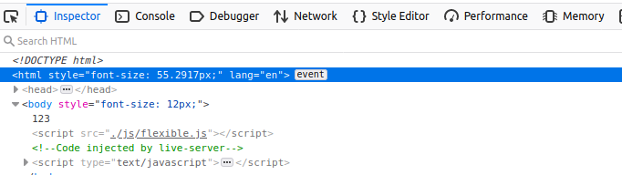
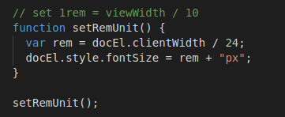
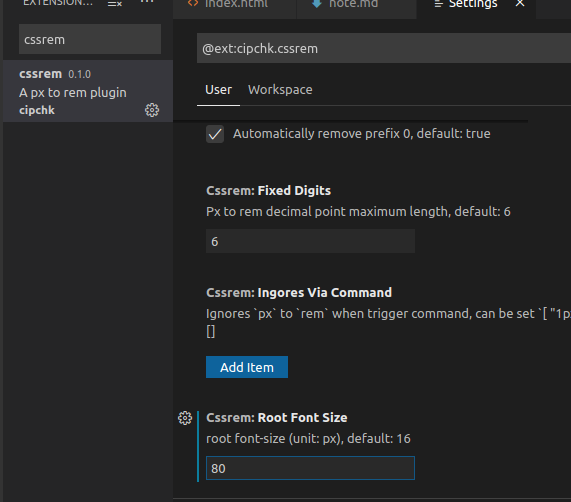

# 一些笔记

## 插件

Easy LESS 可以实时的把 less 文件转换成 css 文件

引入 flexible.js 是否成功看浏览器 web develop 中

flexible.js 可以改变划分大小

    所以rem =1920(设计稿尺寸)/24 = 80px

cssrem 插件,在插件设置里修改成 80,这个插件会帮我们自动把 px 转换成 rem

重启 vscode 生效

## echarts 使用五步骤

1. 下载并引入 echarts.js 文件
2. 准备一个具备大小的 DOM 容器 **必须要有大小**
3. 初始化 echarts 实例对象
4. 指定配置项和数据（option）
5. 将配置项设置给 echarts 实例对象

## echarts option 配置

### 说明

- title: 图表的标题
- tooltip: 图标的提示框组件
- legend: 图例组件
- toolbox: 工具箱组件 可以另存为图片等功能

- grid: 网格配置，可以控制线性图 柱状图 图表大小
  - left
  - right
  - bottom
  - top
  - containLabel: true/false 是否显示刻度标签

- xAxis: 设置X轴的相关ian配置
  - type
  - boundaryGap: true/false 是否让我们的线条和坐标轴有缝隙
  - data

- yAxis:
  - type

- series: 系列图表配置，它决定着显示哪种类型的图表。**里面配置name的话 legend可以删掉**

数据堆叠，同个类目轴上系列配置相同的stack值后，后一个系列的值会在前一个系列的值上相加

- color:[]设置线条的颜色，是个数组
